# 🛠️ Migración de Aplicación: De Linux a Windows

---

## 📖 Introducción

Este manual documenta el proceso de migración del aplicativo **TuDrogueríaAlDía** desde un entorno Linux a Windows. Incluye las validaciones de versiones, la migración de archivos, la configuración del entorno, y los pasos para garantizar un funcionamiento exitoso posterior a la migración.

## 📌 Recomendaciones Previas

Se recuerda que, mientras la aplicación permanece activa, continúa cargando datos en tiempo real. Por lo tanto, es fundamental tener en cuenta las siguientes recomendaciones antes de iniciar cualquier procedimiento de mantenimiento o migración:
* suspender el servicio temporalmente.
* Apagar la aplicación antes de realizar cualquier cambio.
* Subir la nueva veßrsión al entorno correspondiente.
* Ejecutar un backup completo de la base de datos antes de modificarla.
* Verificar la interfaz gráfica y funcionamiento general después de la migración.
* en el archivo de accosos encontrara lo

---

## 🔍 Validaciones Previas

### ✅ Verificación de versiones del aplicativo

Acontinuacion se deben ingresar los siguientes  comandos en la consola para validar los versionamientos de las tecnologias utilizadas en el proyecto

```bash
php --version
# PHP 8.0.30 (cli) (built: Nov 8 2024 19:02:02) (NTS)
```
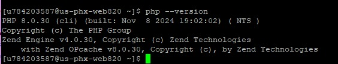

```bash
php artisan --version
# Laravel Framework 8.66.0
```
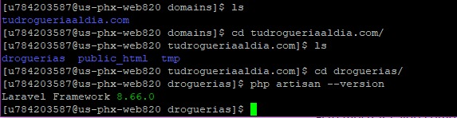

```bash
composer --version
# Composer version 1.10.26 2022-04-13 16:39:56:
```
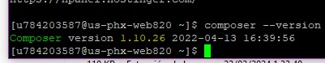

---

### ✅ Verificación de versión de la base de datos

```bash
mysql --version
# mysql  Ver 15.1 Distrib 10.11.10-MariaDB, for Linux (x86_64) using readline 5.1
```


---

## 📁 Carpetas a Migrar

Se deben identificar las **10 carpetas más pesadas** en el entorno Linux. Usa el siguiente comando:

```bash
du -sh * | sort -hr | head -n 10
```
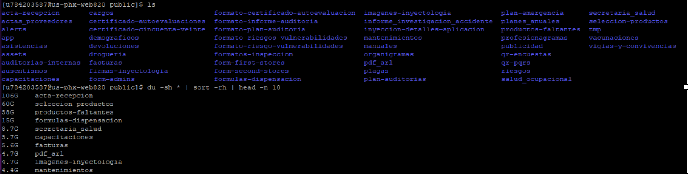

---

## 🔐 Acceso SSH

- **Clave de acceso**: `Fundecopi.2024*`

Asegúrate de tener permisos y acceso por SSH al servidor Linux para iniciar la transferencia.

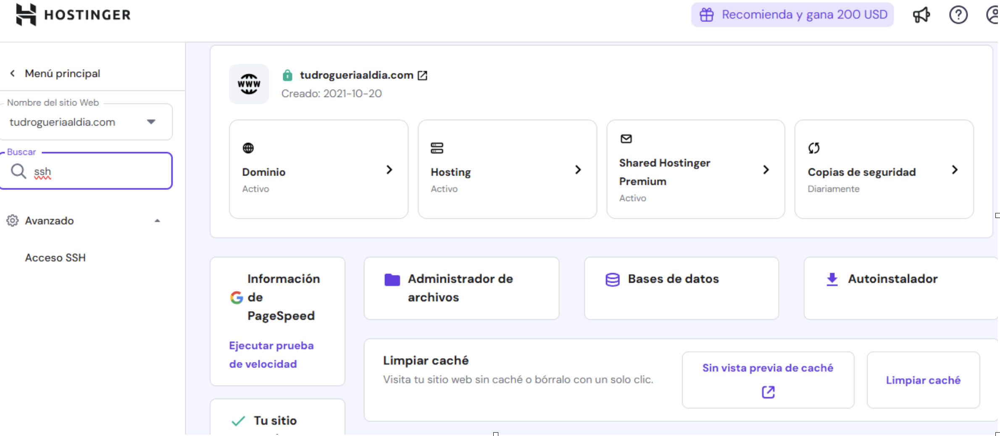
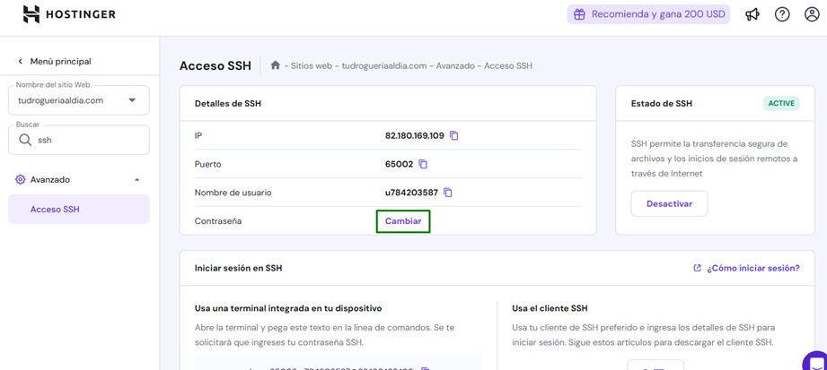

---

## 🚚 Migración del Frontend

Ingrese al servidor desde winscp, debe seleccionar el servidor a donde desea conectarse, he introducir el usuario y contraseña:

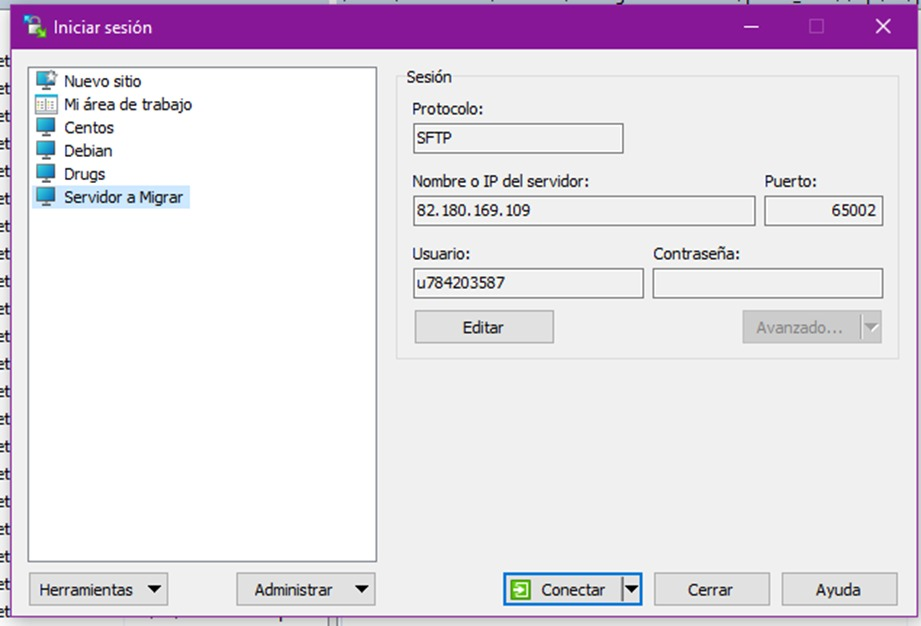

luego copie toda la información relacionada con el frontend del aplicativo al nuevo servidor en Windows.

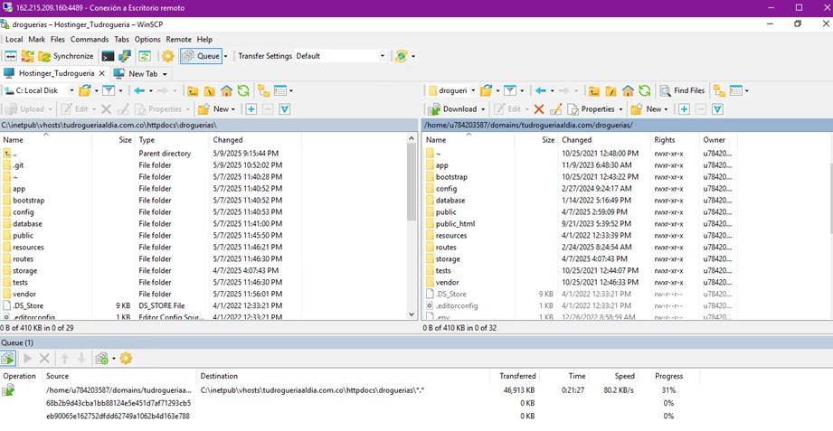

---

## 🗄️ Backup y Restauración de la Base de Datos

Para sacar el backup de la base de datos deben ingresar uno de los seguientes comandos, en el caso que aplique

### 🔹 Backup en Linux

```bash
mysqldump -u u784203587_dev -p u784203587_droguerias > backup_droguerias.sql
```
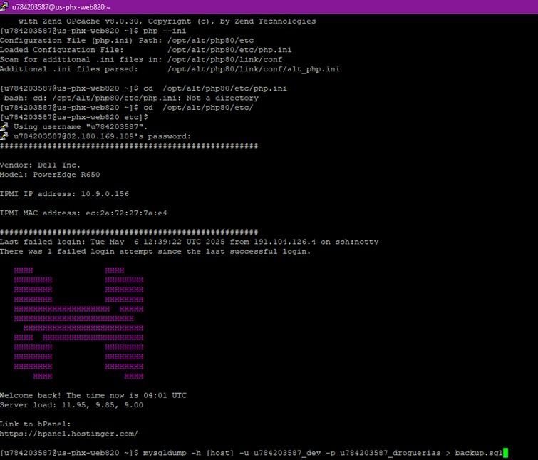

ingrese la contraseña suministrada y luego de clic en enter 

En la parte grafica encontrara un archivo .sql como se muestra acontinuacion

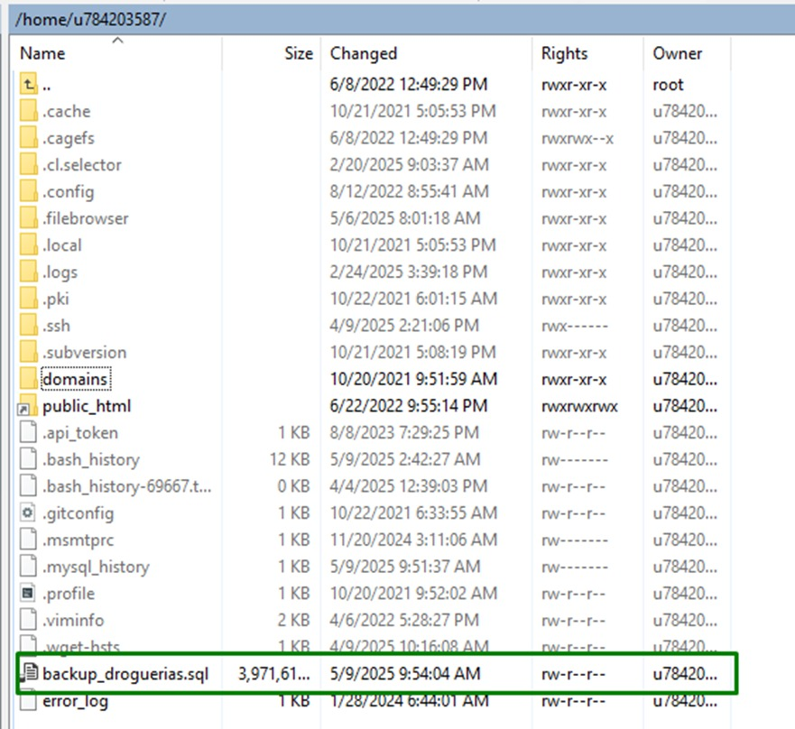

---

## ⚙️ Configuración del Archivo `.env`

Revisar y adaptar el archivo `.env` para el nuevo entorno Windows:

- Configuración de conexión a base de datos.
- URL del servidor.
- Variables necesarias para el entorno productivo.

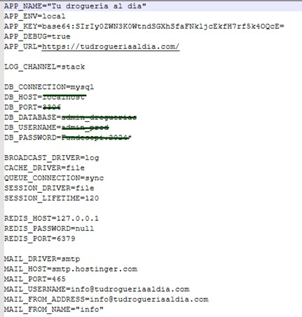

---

## 🧪 Prueba Final del Aplicativo

- Comprobar el correcto despliegue del aplicativo.
- Revisar posibles errores en los logs de Laravel (`storage/logs/`) y del servidor web.
- Asegurar el acceso al frontend desde el navegador.

> Imagen referencial de la prueba:

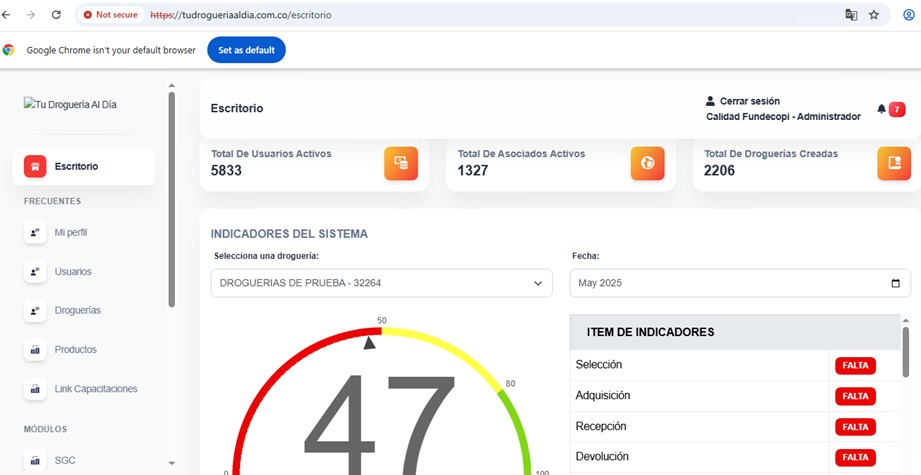

---

## ✅ Conclusión

Una vez validados todos los pasos:

- Verifica que los datos se sigan cargando correctamente.
- Confirma que el entorno de Windows sea estable.
- Asegura que no haya pérdida de información durante la migración.
