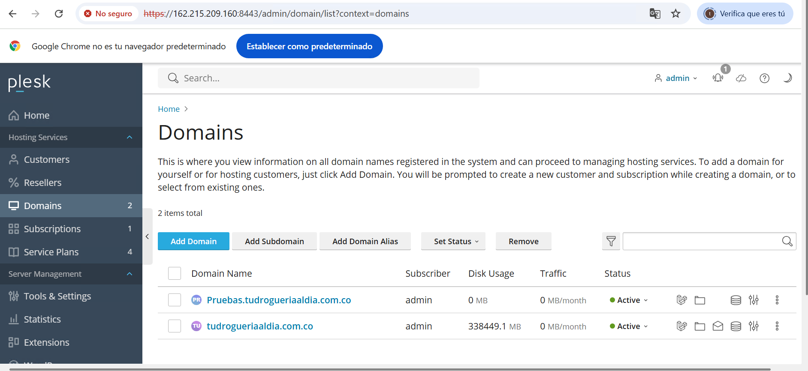
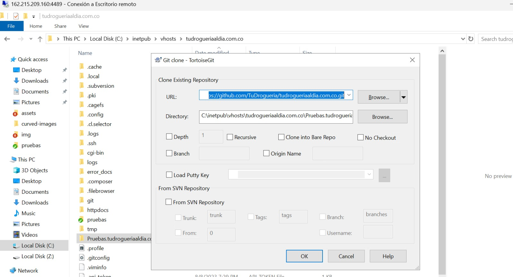
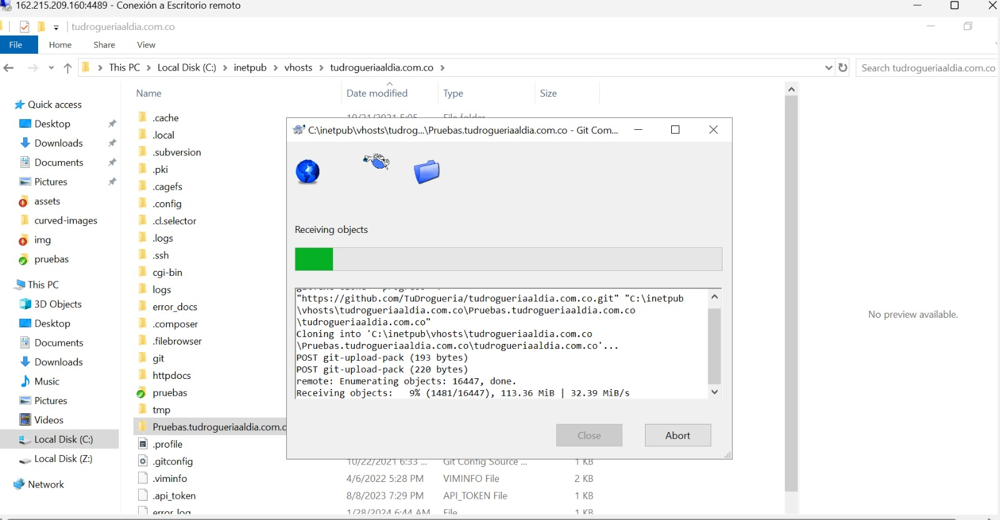
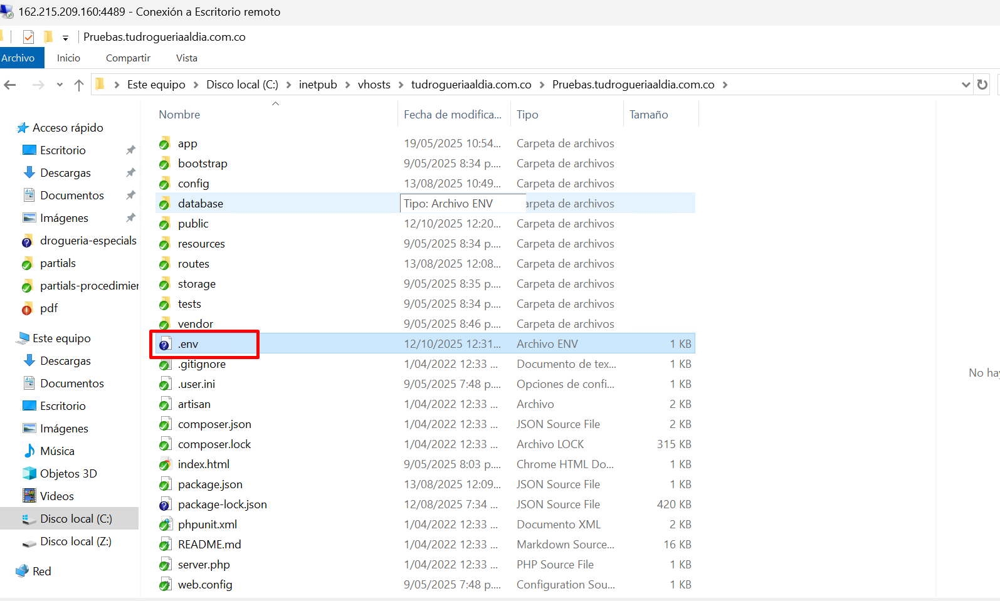
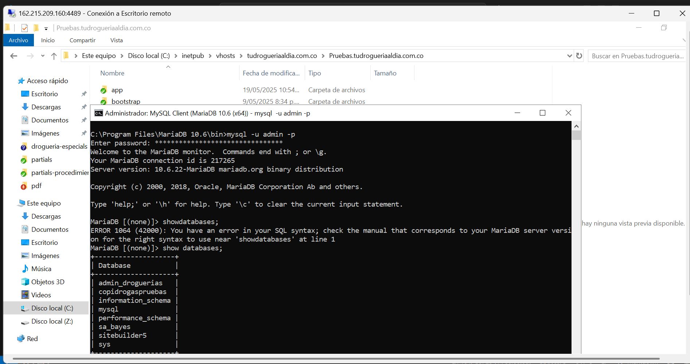
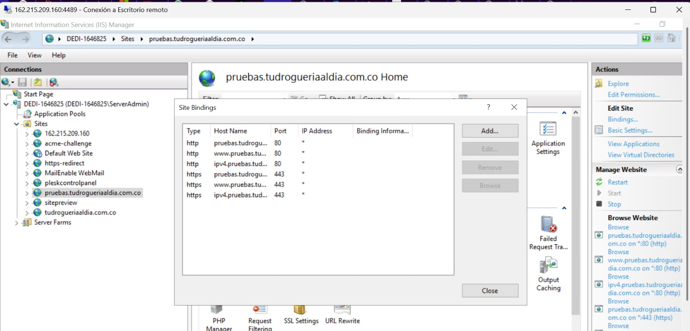
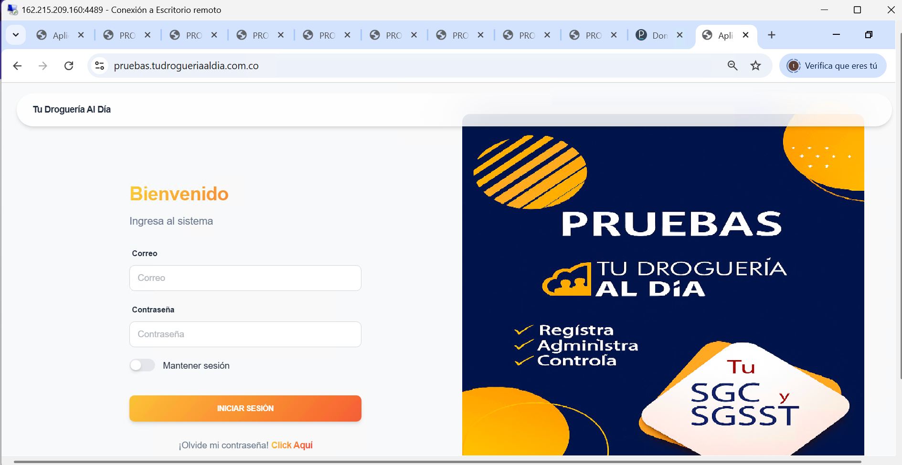

# 🧩 Configuración del Ambiente de Pruebas – TuDrogueríaAlDía

**Fecha:** Octubre 2025  
**Dominio de pruebas:** [https://pruebas.tudrogueriaaldia.com.co/](https://pruebas.tudrogueriaaldia.com.co/)  
**Framework:** Laravel  
**Servidor:** Windows Server con IIS administrado por Plesk  

---

## ⚙️ 1. Descripción General

El entorno de pruebas de *TuDrogueríaAlDía* fue creado para validar nuevas funcionalidades antes de su paso a producción.  
Se utiliza un subdominio independiente (`pruebas.tudrogueriaaldia.com.co`) con su propia base de datos, repositorio y configuración de entorno.

---

## 🌐 2. Creación del Sitio en Plesk / IIS

1. Ingresar al panel **Plesk** con credenciales administrativas.  
2. Crear un nuevo **subdominio** llamado `pruebas.tudrogueriaaldia.com.co`.  
3. Configurar la ruta raíz de publicación del proyecto:  
   ```
   C:\inetpub\vhosts\tudrogueriaaldia.com.co\Pruebas.tudrogueriaaldia.com.co\public   ```
4. Asegurarse de que el **usuario del pool de IIS** tenga permisos de lectura y escritura sobre esta carpeta.  
5. Habilitar PHP versión compatible con Laravel.  
6. Confirmar que las extensiones requeridas estén activas: `openssl`, `pdo_mysql`, `mbstring`, `tokenizer`, `xml`, `curl`, etc.

📷 *Referencia:*  


---

## 📦 3. Clonación del Repositorio

1. Acceder al servidor mediante **Plesk File Manager** o **acceso RDP**.  
2. Clonar el repositorio desde GitHub:
   ```bash
   git clone https://github.com/<usuario>/<repositorio>.git .
   ```
3. Verificar la rama activa (`develop`, `testing` o `main` según el flujo Git).  
4. Si es necesario actualizar:
   ```bash
   git pull origin develop
   ```

📷 *Referencia:*  



---

## ⚙️ 4. Configuración del Entorno Laravel

1. Copiar el archivo de ejemplo:
   ```bash
   cp .env.example .env
   ```

   <br>
   <br>
   <br>
2. Modificar las variables principales del archivo `.env`:

   ```env
   APP_NAME="TuDrogueriaAlDia - Pruebas"
   APP_ENV=local
   APP_DEBUG=true
   APP_URL=https://pruebas.tudrogueriaaldia.com.co

   DB_CONNECTION=mysql
   DB_HOST=192.168.128.11
   DB_PORT=3306
   DB_DATABASE=DINAMICA_PRUEBAS
   DB_USERNAME=usuario_pruebas
   DB_PASSWORD=********

   LOG_CHANNEL=stack
   ```

3. Generar la clave de aplicación:
   ```bash
   php artisan key:generate
   ```

4. Ejecutar migraciones y seeders si aplica:
   ```bash
   php artisan migrate --seed
   ```

📷 *Referencia:*  


---

## 🗄️ 5. Conexión a Base de Datos

- El ambiente de pruebas utiliza una base de datos independiente denominada **copidrogaspruebas**.  
- Se restaura una copia parcial de producción para pruebas controladas.  
- Validar la conexión desde MariaDB Y creacion de base de datos de pruebas:
  ```sql
   mysql -u admin -p

   show databases;

  ```

📷 *Referencia:*  


---

## 🔐 6. Certificado SSL

Si el sitio pierde el certificado SSL en Plesk:

1. Ingresar al dominio desde el panel **Web Hosting Access**.  
2. Verificar que el **Let's Encrypt** esté activo. Si no:  
   - Ir a *Sitios web y dominios → Let's Encrypt*  
   - Seleccionar “Emitir certificado”  
3. Confirmar que en IIS el *Binding HTTPS* use el certificado correcto.  
4. En Laravel, verificar que la URL de la aplicación comience con `https://`.

📷 *Referencia:*  


---

## 🚀 7. Publicación del Proyecto

1. Ejecutar la compilación de dependencias:
   ```bash
   composer install --no-dev
   npm install && npm run prod
   ```
2. Limpiar y optimizar cachés:
   ```bash
   php artisan config:clear
   php artisan cache:clear
   php artisan route:clear
   php artisan view:clear
   php artisan optimize
   ```
3. Confirmar funcionamiento en navegador:
   ```
   https://pruebas.tudrogueriaaldia.com.co/
   ```

📷 *Referencia:*  


---

## 🧰 8. Solución de Problemas Comunes

| Problema | Causa posible | Solución |
|-----------|----------------|-----------|
| **Certificado SSL desapareció** | Plesk cambió configuración o IP del dominio | Reemitir certificado Let's Encrypt |
| **Error 404 o 500** | Falta `public/` como raíz o permisos insuficientes | Verificar ruta raíz y permisos en IIS |
| **Conexión a BD fallida** | IP o credenciales incorrectas | Revisar `.env` y conexión desde el servidor |
| **Archivos temporales o logs no accesibles** | Falta de permisos en `/storage` o `/bootstrap/cache` | Ejecutar `chmod -R 775 storage bootstrap/cache` (en Linux) o asignar permisos en Windows |

---

## 📋 9. Recomendaciones Finales

- Mantener sincronizados los entornos **desarrollo → pruebas → producción**.  
- Realizar pruebas de API, notificaciones y cargas antes del despliegue oficial.  
- Documentar cada cambio aplicado en este ambiente en el repositorio (`README.md` o `CHANGELOG.md`).  
- Programar renovación automática de certificados SSL cada 90 días.  

---

**Documento elaborado para control interno – Área de Desarrollo y QA**  
*TuDrogueríaAlDía © 2025*
