# 🧩 Entrega de Desarrollos y Requerimientos Adicionales – TuDrogueríaAlDía

**Fecha:** Octubre 2025  
**Dominio de pruebas:** [https://pruebas.tudrogueriaaldia.com.co/](https://pruebas.tudrogueriaaldia.com.co/) 
**Dominio de produccion:** [https://tudrogueriaaldia.com.co/](https://tudrogueriaaldia.com.co/) 
**Framework:** Laravel  
**Servidor:** Windows Server con IIS administrado por Plesk  

---

## ⚙️ 1. Descripción General

Este documento presenta la entrega técnica de los desarrollos y requerimientos adicionales implementados en el sistema TuDrogueríaAlDía, correspondientes a la fase de mejora funcional y actualización de los módulos de documentación, control de calidad y procedimientos internos.

El trabajo se realizó bajo el framework Laravel, asegurando compatibilidad con el entorno de producción configurado en Plesk y bases de datos MySQLr.
Todas las pruebas iniciales se ejecutaron en el entorno de pruebas antes de proceder con la migración definitiva al dominio productivo.

---

## 🌐 2. Alcance

Los desarrollos incluyeron ajustes en manuales, formularios, procedimientos y módulos administrativos, con énfasis en:

-  Mejorar la usabilidad y trazabilidad del sistema documental.

-  Centralizar la cabecera y estilos del sistema en un solo archivo base.

-  Estandarizar los manuales y procedimientos en vistas Blade reutilizables.

-  Optimizar el rendimiento en el módulo de usuarios administrativos.


---

## 📦 3. Desarrollos y Requerimientos Implementados

1. Requerimiento 12: Enlazar formularios con manuales

Se integraron los formularios de cada documento con sus respectivos manuales mediante botones o enlaces contextuales dentro del sistema, lo que facilita la navegación entre registros y documentación técnica asociada.

Cada formulario ahora redirige directamente al documento PDF o plantilla correspondiente, optimizando el flujo de revisión documental.

2. Requerimiento 13: Enlazar procedimientos funcionales a submódulos

Se habilitaron enlaces directos desde la presentación de cada submódulo hacia sus procedimientos funcionales, permitiendo la consulta inmediata del marco de actuación definido en el sistema de gestión de calidad.

Esto se estructuró bajo un modelo de plantillas Blade que carga dinámicamente los procedimientos almacenados.


📷 *Referencia:*  
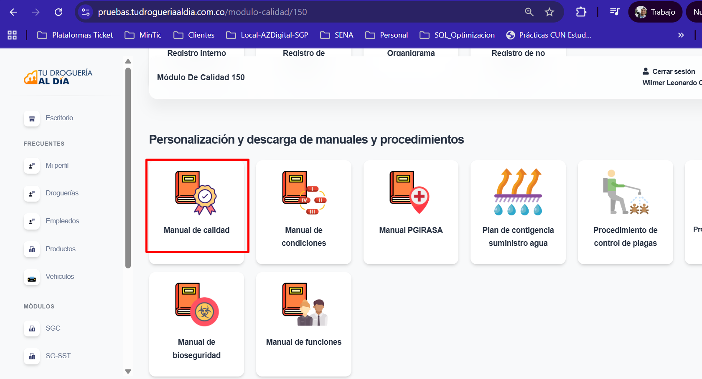
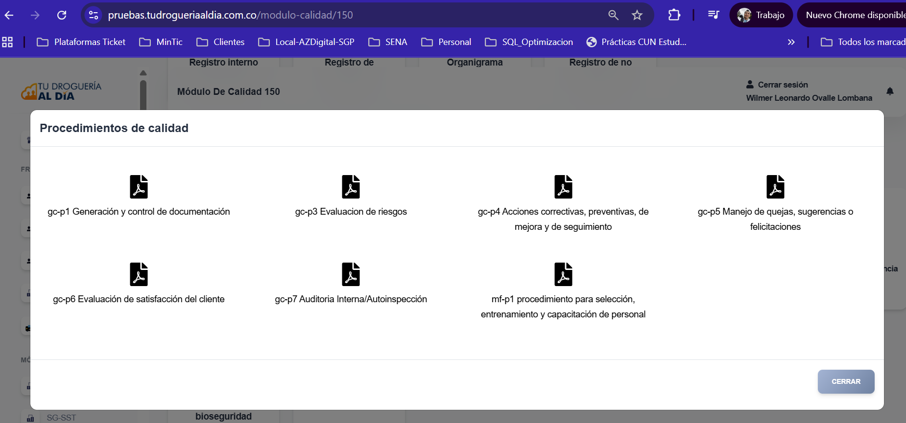

---

## 🗄️ 4. Integración de Estilos y Cabeceras

Se consolidaron los estilos visuales en un solo archivo central (styles_quality.blade.php), garantizando uniformidad en todos los manuales y procedimientos, además de reducir duplicidad de código.

Los encabezados y pies de página se modularizaron en partials.header y partials.footer, aplicables de forma global a todo el sistema PDF.
Por ejemplo el header:

   ```html
   {{-- Incluir estilos del header --}}
@include('pdf.partials.styles_header')

<div class="header">
    <center>
        <div class="header-container">
            <table class="header-table" cellpadding="5" cellspacing="0">
                <tr valign="top">
                    <td class="image-cell" rowspan="4" bgcolor="#ffffff">
                        
                    </td>
                    <td class="content-full" colspan="2">
                        <b>{{ strtoupper($titulo_header ?? 'MANUAL') }}</b>
                    </td>
                </tr>
                <tr valign="top">
                    <td class="content-full" colspan="2">
                        <b>
                            @if(isset($store) && !empty($store->name))
                                {{ strtoupper($store->name) }}
                            @elseif(isset($condicion['store']['name']) && !empty($condicion['store']['name']))
                                {{ strtoupper($condicion['store']['name']) }}
                            @else
                                NOMBRE NO DISPONIBLE
                            @endif
                        </b>
                    </td>
                </tr>
                <tr valign="top">
                    <td class="content-half"><b>VERSIÓN Nº: 2</b></td>
                    <td class="content-half"><b>CÓDIGO:</b> MC-1</td>
                </tr>
                <tr valign="top">
                    <td class="content-half"><b>FECHA: 26-05-2025</b></td>
                    <td class="content-half"><b>PÁGINA:</b> <span class="page-num"></span> de 12</td>
                </tr>
            </table>
        </div>
    </center>
</div>

   ```
📷 *Referencia:*  
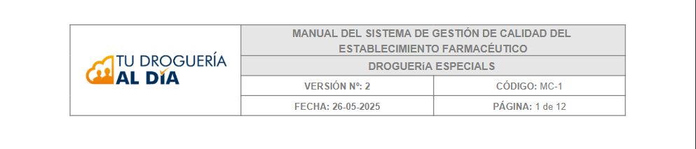

---

## 🗄️ 5. Actualización de Manuales de Calidad desde el Aplicativo

El Manual del Sistema de Gestión de Calidad del Establecimiento Farmacéutico fue rediseñado con integración directa desde el aplicativo Laravel, permitiendo su actualización automática desde la vista correspondiente :

  ```php
@php
$titulo_header = 'MANUAL DEL SISTEMA DE GESTIÓN DE CALIDAD DEL ESTABLECIMIENTO FARMACÉUTICO';
@endphp

<!DOCTYPE html>
<html>
<head>
  <meta charset="UTF-8">
  <title>@yield('title', 'MANUAL DEL SISTEMA DE GESTIÓN DE CALIDAD')</title>
  @include('pdf.partials.styles_quality')
</head>
<body>
  @include('pdf.partials.header')

  <div class="content">
    @yield('content')
    @include('pdf.C1')
  </div>

  @include('pdf.partials.footer')
</body>
</html>


  ```

📷 *Referencia:*  
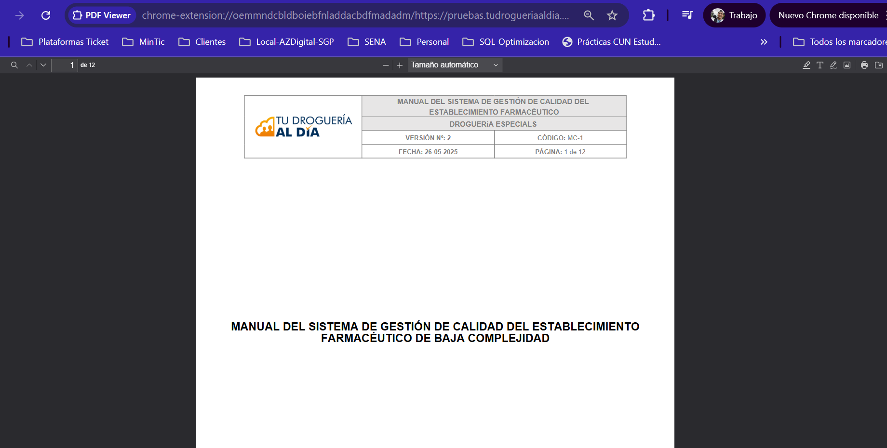

---

## ⚙️ 6. Diseño de Manuales y Procedimientos

1. Implementación técnica:

Se construyó un esquema modular que centraliza la definición de estilos, encabezados y pies de página para todos los documentos PDF del sistema para este proceso se crearon P1,P2,P3,P4,P5,P6,P7 :


   ```php
   
   @php
$titulo_header = 'PROCEDIMIENTO DE CONTROL DOCUMENTAL'; // Definido solo aquí
@endphp

<!DOCTYPE html>
<html>
<head>
  <meta charset="UTF-8">
  <title>@yield('title', 'PROCEDIMIENTO DE CONTROL DOCUMENTAL')</title>
  @include('pdf.partials.styles_quality')
</head>
<body>
  @include('pdf.partials.header')

  <div class="content">
    @yield('content')
    @include('pdf.partials-procedimientos.P1')
  </div>

  @include('pdf.partials.footer')
</body>
</html>

   ```


📷 *Referencia:*  
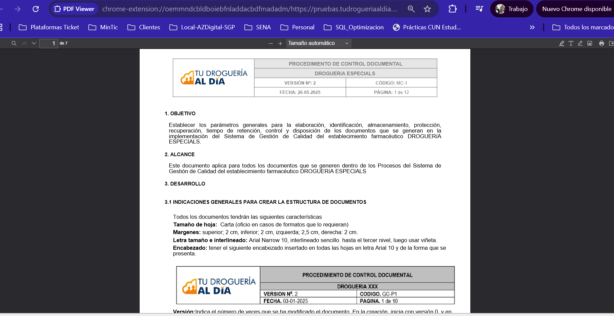

---


## 🚀 7. Actualizaciones Complementarias


-  Inclusión de opción “N/A” en el manual de calidad:
Añadida la opción “No Aplica” para procesos no sujetos a revisión directa.

📷 *Referencia:*  
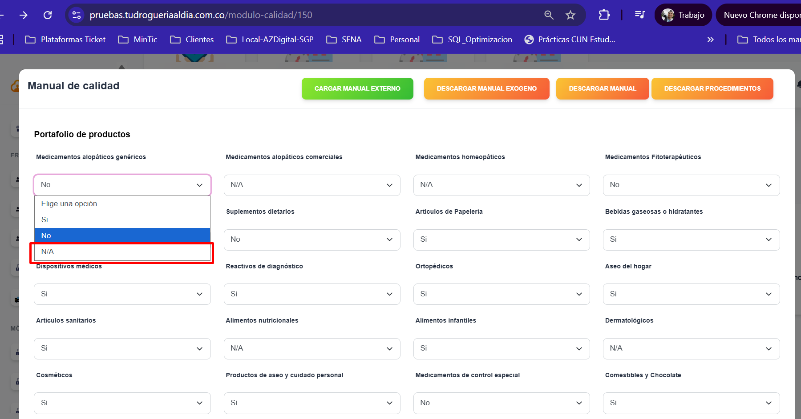

-  Actualización de formularios y botones:
Se mejoraron los formularios de generación de documentos, unificando el comportamiento de los botones de acción del formulario de calidad .

📷 *Referencia:*  
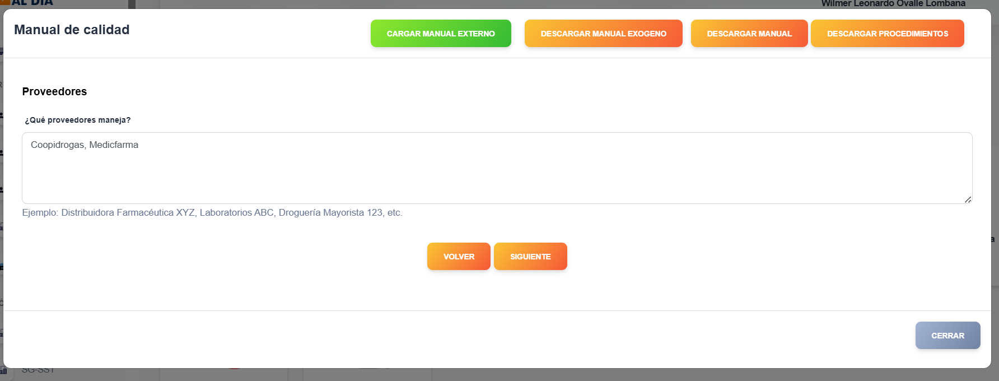
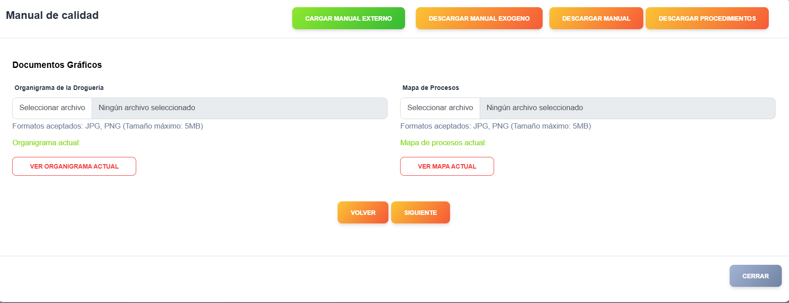


-  Optimización del módulo de usuarios (administrador):
Reducción de tiempos de carga mediante la optimización de consultas SQL y la implementación de caché interna.


📷 *Referencia:*  
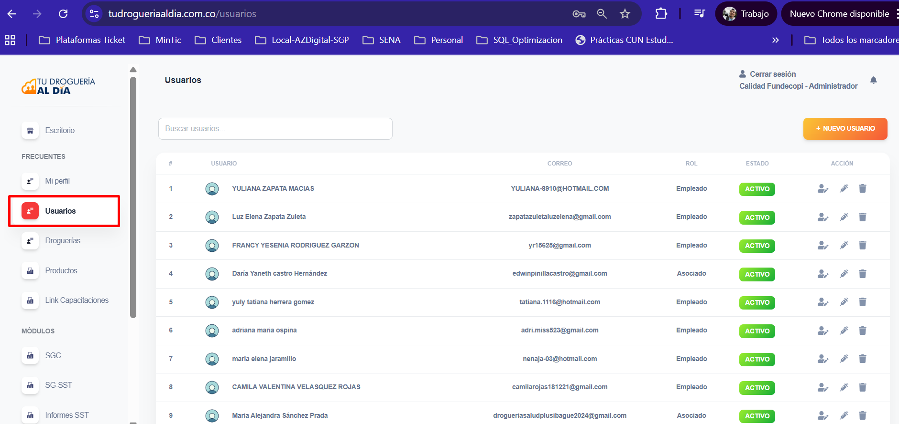

---

## 🧰 8. Validación en Entorno de Pruebas

Antes del despliegue, todas las funciones fueron validadas en:
🔹 https://pruebas.tudrogueriaaldia.com.co/

Se realizaron las siguientes comprobaciones:

1. Revisión de consistencia visual en los encabezados y estilos.

2. Integración de plantillas PDF.

3. Acceso a formulario de Calidad para parametrizar campos.

4. Generación dinámica de Manual de calidad.

5. Generación dinámica de procedimientos.


## 📋 9. Paso a Producción

Tras las pruebas exitosas, se procedió al despliegue hacia producción:
🔹 https://tudrogueriaaldia.com.co/

Entrega Procedimiento técnico :

- Formulario de Manual de calidad.


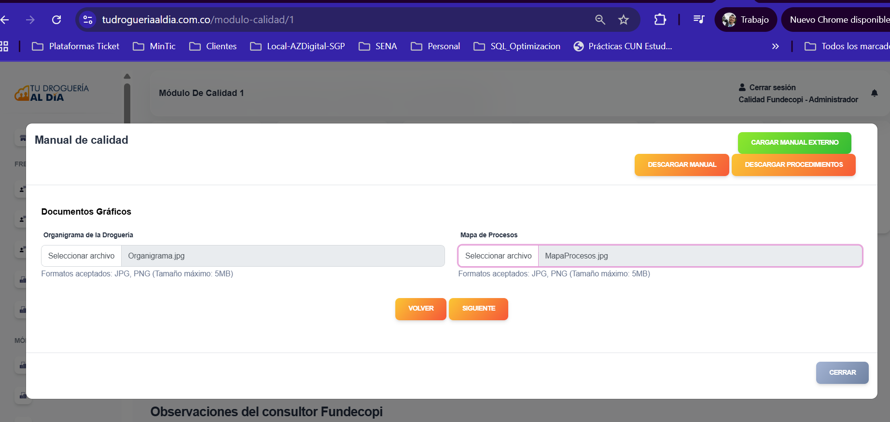

- Generacion Dinamica Manual de calidad.

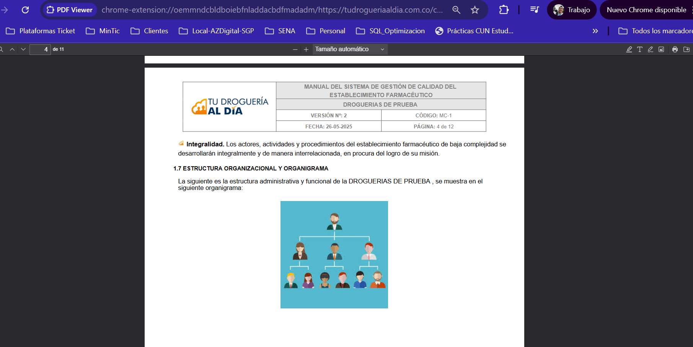

- Generacion Dinamica de Manuales de Procedimientos.

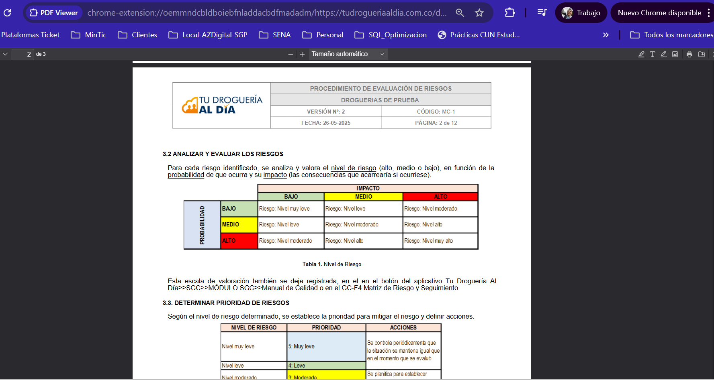


---

**Documento elaborado para control interno – Área de Desarrollo y QA**  
*TuDrogueríaAlDía © 2025*
